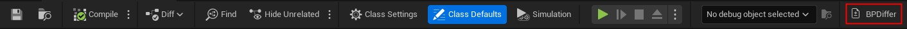
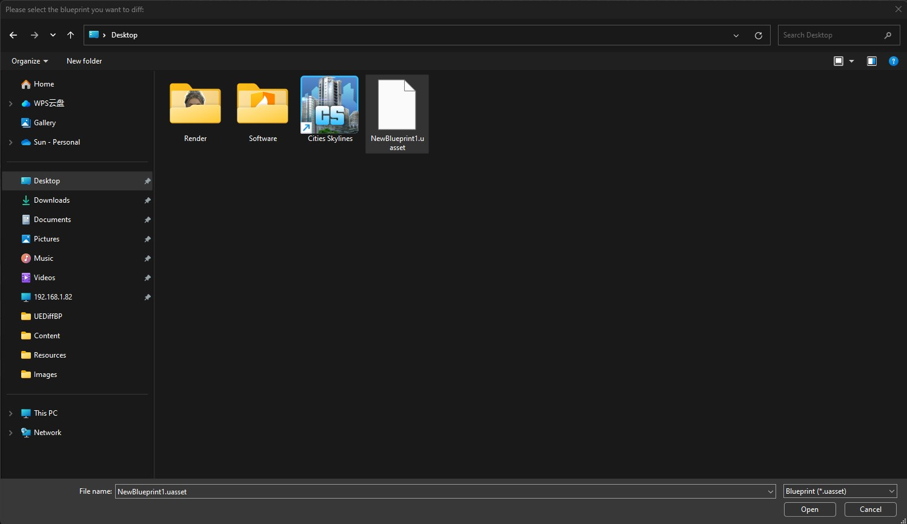
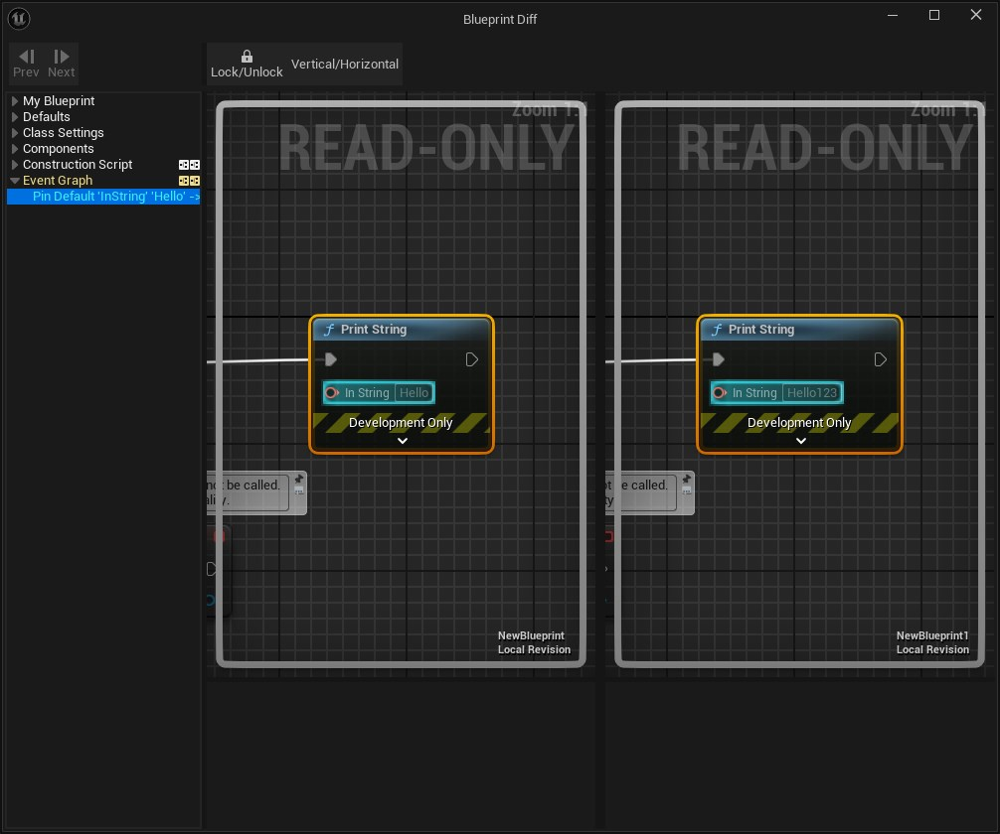

# BPDiffer

## Description

The [Unreal Diff Tool](https://dev.epicgames.com/documentation/en-us/unreal-engine/ue-diff-tool-in-unreal-engine) compares assets in Unreal Engine. It supports:
- Comparing an asset with a previous version of itself from source control.
- Comparing two different assets.

But it doesn't support comparing with assets outside of the project.

This is a simple Unreal Editor plugin that allows user to Blueprint Diff with even **external** blueprint file.

## Requirements

- Windows
- UE 5.4 or newer

## How to install

1. Clone this repo into **\<ProjectDirectory\>/Plugins**
2. Launch project
3. If it's not enabled: Go to Edit -> Plugins -> "Project" category -> Editor -> Enable "BPDiffer" and restart the editor
4. Done

## How to use

1. Open any blueprint asset you want to diff
2. You should see a new button in the toolbar called "BPDiffer", click it

	

3. Select the blueprint file you want to diff with in the pop-up File Dialog window

	

4. Check result in the Blueprint Diff window

	

5. Done

## To Do

- [x] Open Blueprint Diff window directly in current Unreal Editor instead of creating another Editor process. [Reference Solution](https://github.com/EpicGames/UnrealEngine/blob/c830445187784f1269f43b56f095493a27d5a636/Engine/Source/Editor/UnrealEd/Private/EditorCommandLineUtils.cpp#L454)
